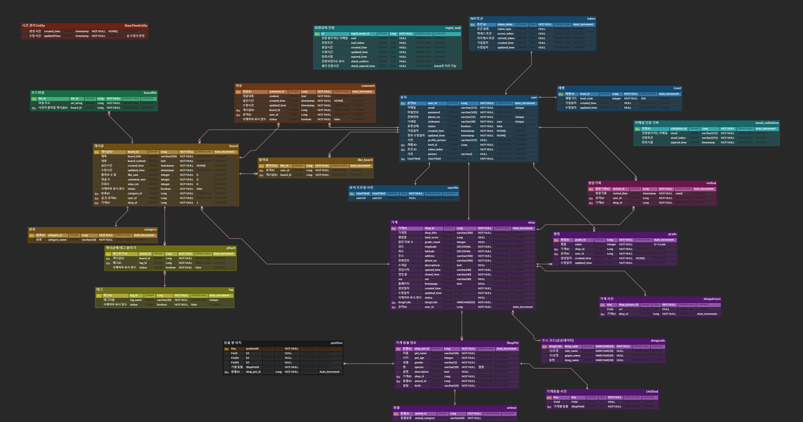

# Homo SSAFY-ens : PET-MAN(BE)

## 🔷 프로젝트 소개

### ✔ 작성 정보

- 작성자 : 서울 1반 A105
- 날짜 : 2023.07.03 ~ 2023.08.18 (총 7주)

| 멤버 | 담당    |
| --- |-------|
| 👑 송진현😭| 추가 예정 |
| 🦘 이제원  |       |
| 🐻 박동건  |  |

### 프로젝트 구분

| Application | Domain | Language | Framework |
| --- | --- | --- | --- |
| ✅ Desktop Web | ⬜ AI | ✅ JavaScript | ⬜ Vue.js |
| ⬜ Mobile Web | ⬜ Big Data | ⬜ TypeScript | ✅ React |
| ✅ Responsive Web | ⬜ Blockchain | ⬜ C/C++ | ⬜ Angular |
| ⬜ Android App | ✅ Responsive Web | ⬜ C# | ✅ Node.js |
| ⬜ iOS App | ⬜ AR/VR/Metaverse | ⬜ Python | ⬜ Flask/Django |
| ⬜ Desktop App | ⬜ Game | ✅ Java | ✅ Spring/Springboot |
|  |  | ⬜ Kotlin |  |


### ✔ 목표

> 전국 애견카페 커뮤니티
>

<br>

## 프로젝트 관리

### 📅 프로젝트 진행 일정

| 일자            | 내용                                            |
|---------------|-----------------------------------------------|
| 2023-07-10(월) | Jira 생성, 기능명세서 작성                             |
| 2023-07-11(화) | 스프린트1 ERD, 메뉴 명세서 작성 완료, api 명세서, figma 작업 시작 |
| 2023-07-12(수) | api 명세서 작성 완료, 프로젝트 파일구조 정리                   |

### ✔ 회의록

- 레퍼런스, 메모 등 추가

<br>

## 개발 규칙(필요시 추가)

- git을 이용한 협업시 각자의 작업물은 각자의 개인 branch에 push하고, 기능이 완성되면 master branch에 합친다(팀장 포함).
- 각자 기능 개발 후 git에 `add-commit-push`하기 전, 각자의 작업영역을 사전에 공유한다.
- 커밋 메시지 양식은 다음과 같이 통일한다.

  | Tag Name         | Description                                                  |
    |------------------|--------------------------------------------------------------|
  | Feat             | 새로운 기능을 추가                                                   |
  | Fix              | 버그 수정                                                        |
  | Design           | css 등 사용자 UI 디자인 변경                                          |
  | !BREAKING CHANGE | 커다란 API 변경의 경우                                               |
  | !HOTFIX          | 급하게 치명적인 버그를 고쳐야하는 경우                                        |
  | Style            | 코드 포멧 변경, 세미 콜론 누락, 코드 수정이 없는 경우                             |
  | Refactor         | 프로덕션 코드 리팩토링                                                 |
  | Comment          | 필요한 주석 추가 및 변경                                               |
  | Docs             | 문서 수정                                                        |
  | Test             | 테스트 코드, 리펙토링 테스트 코드 추가, Production Code(실제로 사용하는 코드) 변경 없음   |
  | Chore            | 빌드 업무 수정, 패키지 매니저 수정, 패키지 관리자 구성 등 업데이트, Production 코드 변경 없음 |
  | Rename           | 파일 혹은 폴더명을 수정하거나 옮기는 작업만인 경우                                 |
  | Remove           | 파일을 삭제하는 작업만 수행한 경우                                          |

- back-end에서 메소드는 다음과 같은 명명 규칙을 따른다.

  | Method | Name    |
    |--------|---------|
  | GET    | show-   |
  | POST   | regist- |
  | PUT    | update- |
  | DELETE | delete- |

- Java와 SQL에서 모든 변수는 camelCase로 쓴다.
- `HttpStatus`를 사용하는 경우 다음과 같은 규칙을 따른다.

| Status Code | Name | Use Case           |
| --- | --- |--------------------|
| 200 | OK | 성공한 GET, PUT 요청    |
| 201 | Created | 성공한 POST 요청        |
| 204 | No Content | 성공한 DELETE 요청      |
| 400 | Bad Request | 유효하지 않은 컨텐츠: 요청 실패 |

<br>

## 설계

### 📂 프로젝트 폴더 구조

```markdown
📂 backend
	ㄴ ...
	ㄴ 📂 main
			ㄴ 📂 java
					ㄴ 📂 com.petman
							ㄴ 📄 PetmanBackEndApplication.java
					ㄴ 📂 com.petman.config
							ㄴ 📄 DBConfig.java
							ㄴ 📄 SwaggerConfig.java -> front와 결합 전 기능 테스트용
							ㄴ 📄 WebConfig.java
					ㄴ 📂 com.petman.board
							ㄴ 📂 controller
									ㄴ 📄 BoardController.java
							ㄴ 📂 service
									ㄴ 📄 BoardService.java
							ㄴ 📂 repository
									ㄴ 📄 BoardRepository.java
							ㄴ 📂 dto
									ㄴ 📄 BoardRequestDto.java
									ㄴ 📄 BoardResponseDto.java
							ㄴ 📂 entity
									ㄴ 📄 Board.java
					ㄴ 📂 com.petman.comment
							ㄴ 📂 controller
									ㄴ 📄 CommentController.java
							ㄴ 📂 service
									ㄴ 📄 CommentService.java
							ㄴ 📂 repository
									ㄴ 📄 CommentRepository.java
							ㄴ 📂 dto
									ㄴ 📄 CommentRequestDto.java
									ㄴ 📄 CommentResponseDto.java
							ㄴ 📂 entity
									ㄴ 📄 Comment.java
					ㄴ 📂 com.petman.shop
							ㄴ 📂 controller
									ㄴ 📄 ShopController.java
							ㄴ 📂 service
									ㄴ 📄 ShopService.java
							ㄴ 📂 repository
									ㄴ 📄 ShopRepository.java
							ㄴ 📂 dto
									ㄴ 📄 ShopRequestDto.java
									ㄴ 📄 ShopResponseDto.java
							ㄴ 📂 entity
									ㄴ 📄 Shop.java
					ㄴ 📂 com.petman.user
							ㄴ 📂 controller
									ㄴ 📄 UserController.java
							ㄴ 📂 service
									ㄴ 📄 UserService.java
							ㄴ 📂 repository
									ㄴ 📄 UserRepository.java
							ㄴ 📂 dto
									ㄴ 📄 UserRequestDto.java
									ㄴ 📄 UserResponseDto.java
							ㄴ 📂 entity
									ㄴ 📄 User.java
			ㄴ 📂 resources
					ㄴ 📂 static
							ㄴ 📂 img
					ㄴ 📄 application.yml
```


### API

- User

  | 방식 | 경로 | 권한 | 기능 |
    | --- | --- | --- | --- |
  | GET | /api/user/{userId} | 일반 | 회원정보 받기(마이페이지) |
  | GET | /api/user | 관리자 | 전체 회원 받아오기 |
  | POST | /api/user/login | 전체 | 로그인 하기 |
  | POST | /api/user/new | 전체 | 회원가입 |
  | PUT | /api/user | 전체 | 회원 정보 수정 |
  | DELETE | /api/user/{userId} | 전체 | 회원 삭제 |

- Board

  | 방식 | 경로 | 권한 | 기능 |
    | --- | --- | --- | --- |
  | GET | /api/board/list?tag={1,2,3}&word=”검색키워드” | - | 게시물 리스트 |
  | GET | /api/board/{boardId} | - | 상세 게시물 보기 |
  | POST | /api/board/new | 전체 | 게시글 생성 |
  | PUT | /api/board | 전체 | 게시글 수정 |
  | DELETE | /api/board/{boardId} | 전체 | 게시글 삭제 |

- Comment

  | 방식 | 경로 | 권한 | 기능 |
    | --- | --- | --- | --- |
  | GET | /api/comment/{boardId} | - | 해당하는 게시물 댓글 가져오기 |
  | POST | /api/comment/new | - | 댓글 넣기 |
  | PUT | /api/comment | 전체 | 댓글 수정하기 |
  | DELETE | /api/comment/{commentId} | 전체 | 댓글 삭제하기 |

- Shop

  | 방식 | 경로 | 권한 | 기능 |
    | --- | --- | --- | --- |
  | GET | /api/shop/list | - | 가게 리스트 |
  | GET | /api/shop/{shopId} | - | 가게 상세정보 보기 |
  | POST | /api/shop/new | User | 공공데이터 API로 사업자 번호 인증 및 사업 분야 체크 |
  | PUT | /api/shop | Business | 가게 정보 수정 |
  | DELETE | /api/shop/{shopId} | Business | 가게정보삭제 |

### Entity Relationship Diagram



```sql
-- SQL 문 입력

```